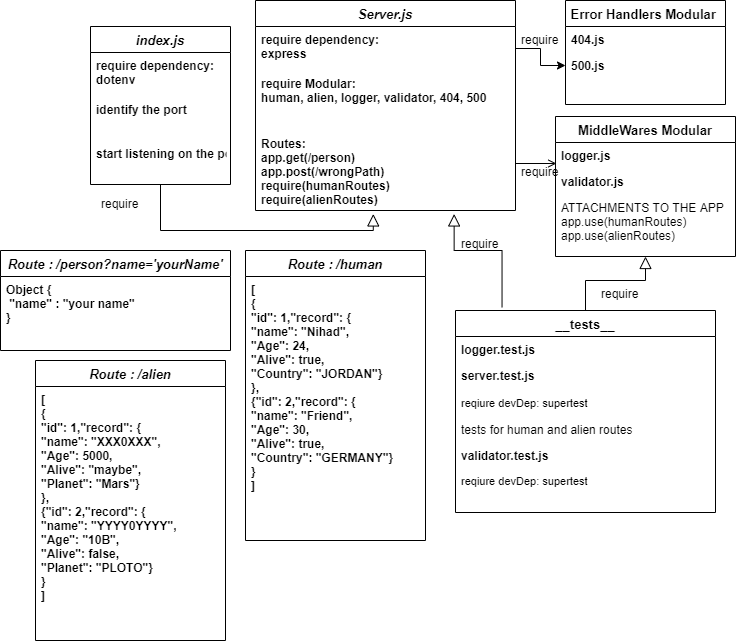

# Class 02
# basic-express-server

### Deployment Test
  - Author: Nihad Zeidan

  - Tests report

[Heroku](https://nihad-basic-express-server.herokuapp.com/person?name=nihad)

[Actions-GitHub](https://github.com/NihadZeidan/basic-express-server/actions)

[PullRequest-GitHub](https://github.com/NihadZeidan/basic-express-server/pull/1)

### `.env` requirements
 - PORT - Port Number

### Running the app
 - `npm i` : to install the required dependencies

-  Endpoint: `/person?name=yourName`

Returns Object
{
"name" : "your Name"
}

### Tests
Unit Tests: `npm run test`

### UML Diagram

------------------------------------------------------------------

# Class 03

# Express REST API

### Deployment Test
  - Author: Nihad Zeidan

  - Tests report

[Heroku For Human Route](https://nihad-basic-express-server.herokuapp.com/human)

[Heroku For Alien Route](https://nihad-basic-express-server.herokuapp.com/alien)

[Actions-GitHub](https://github.com/NihadZeidan/basic-express-server/actions)

[PullRequest-GitHub](https://github.com/NihadZeidan/basic-express-server/pull/3)
 

### `.env` requirements
 - PORT - Port Number

### Running the app
 - `npm i` : to install the required dependencies

Apply CRUD methods to these too routs:

-  Endpoint: `/human`
-  Endpoint: `/alien`

Returns Object
whatever you put in the body.

### Tests
Unit Tests: `npm run test`

### UML Diagram

 

